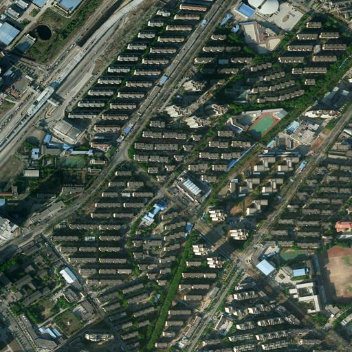
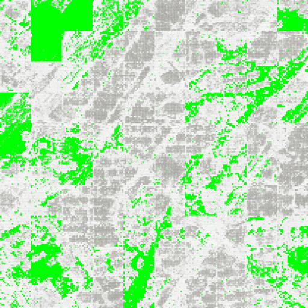
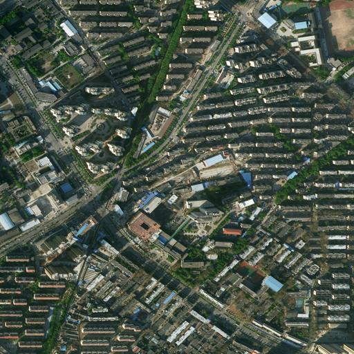
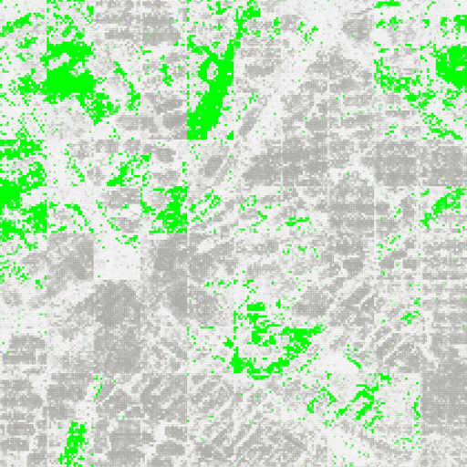

# urban_seg

<table>
  <tr>
    <td></td>
    <td></td>
    <td></td>
    <td></td>
  </tr>
</table>

<!--   -->

This project is a beginner-friendly semantic segmentation project based on remote sensing images.
We use the Unicom model pretrained on **400 million** images, which is highly efficient and performs exceptionally well on remote sensing segmentation tasks.
Surprisingly, we achieve excellent results by training the model with only **4** remote sensing images.
If you want to get started quickly, you can use `train_one_gpu.py` for training, which is a simple code with only 200 lines.
However, if you aim for better performance, you can try a slightly more complex code, `train_multi_gpus.py`, which supports multi-GPU training.

Please note that `train_multi_gpus.py` may require some additional configurations and settings to run multi-GPU training correctly. Make sure to carefully read the instructions and documentation in the code to ensure proper setup and configuration.

## Installation

```bash
git clone https://github.com/anxiangsir/urban_seg.git
```

## Usage

### Install Dependencies
```bash
pip install -r requirements.txt
```

### Data and Pretrained Models

The dataset provided by CCF Satellite Image AI Classification and Recognition competition contains a total of five satellite remote sensing images.

[Baidu Cloud](https://pan.baidu.com/s/1LWBMklOr39yI7fYRQ185Og), Password: 3ih2

```
dataset
├── origin // 5 remote sensing images with labels
├── test   // 3 remote sensing images without labels, not used in this task
└── train  // empty, generated by random sampling using `python preprocess.py`
    ├── images
    └── labels
FP16-ViT-B-32.pt
FP16-ViT-B-16.pt
FP16-ViT-L-14.pt
FP16-ViT-L-14-336px.pt
```

### Training on a Single GPU

1. Download the dataset to the current directory.
2. Preprocess the data.
```bash
python preprocess.py
```
3. Train the model.
```bash
python train_one_gpu.py
```

### Training on Eight GPUs
1. Download the dataset to the current directory.
2. Preprocess the data.
```bash
python preprocess.py
```
3. Train the model.
```
torchrun --nproc_per_node 8 train_multi_gpus.py
```

## Discussion and Feedback
QQ Group: 679897048

## Cite Us
If you find this project useful, please consider citing our paper:
```
@inproceedings{an2023unicom,
  title={Unicom: Universal and Compact Representation Learning for Image Retrieval},
  author={An, Xiang and Deng, Jiankang and Yang, Kaicheng and Li, Jiawei and Feng, Ziyong and Guo, Jia and Yang, Jing and Liu, Tongliang},
  booktitle={ICLR},
  year={2023}
}
```